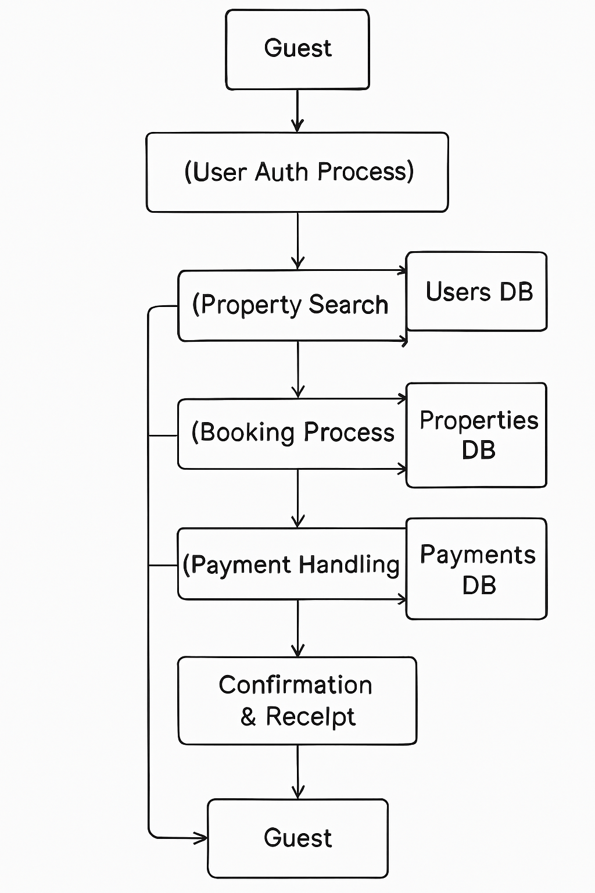

# 🔄 Data Flow Diagram – Airbnb Clone Backend

This Data Flow Diagram (DFD) illustrates how data moves through the backend system of the Airbnb Clone project. It captures the relationships between users, processes, and data stores.

## 🎯 Objective

To show how core backend operations such as registration, listing properties, booking, and payments process user data and interact with databases.

---

## 🧱 Components

### 👥 External Entities
- **Guest** – uses the platform to search, book, and pay
- **Host** – lists and manages properties
- **Admin** – monitors users and listings

### 🔄 Processes
- **User Authentication**
- **Property Management**
- **Booking System**
- **Payment Gateway Integration**

### 🗄️ Data Stores
- **Users DB**
- **Properties DB**
- **Bookings DB**
- **Payments DB**

---

## 🖼️ Diagram

> Arrows indicate how data flows between processes, entities, and data stores during backend operations.

---

## 📁 File Structure

data-flow-diagram/
├── data-flow.png # PNG file showing the data flow diagram
└── README.md # This documentation file

---

## ✅ Use Case

This diagram supports understanding of:
- Backend logic and data transformation
- Inter-module communication
- System-wide dependencies and database operations
