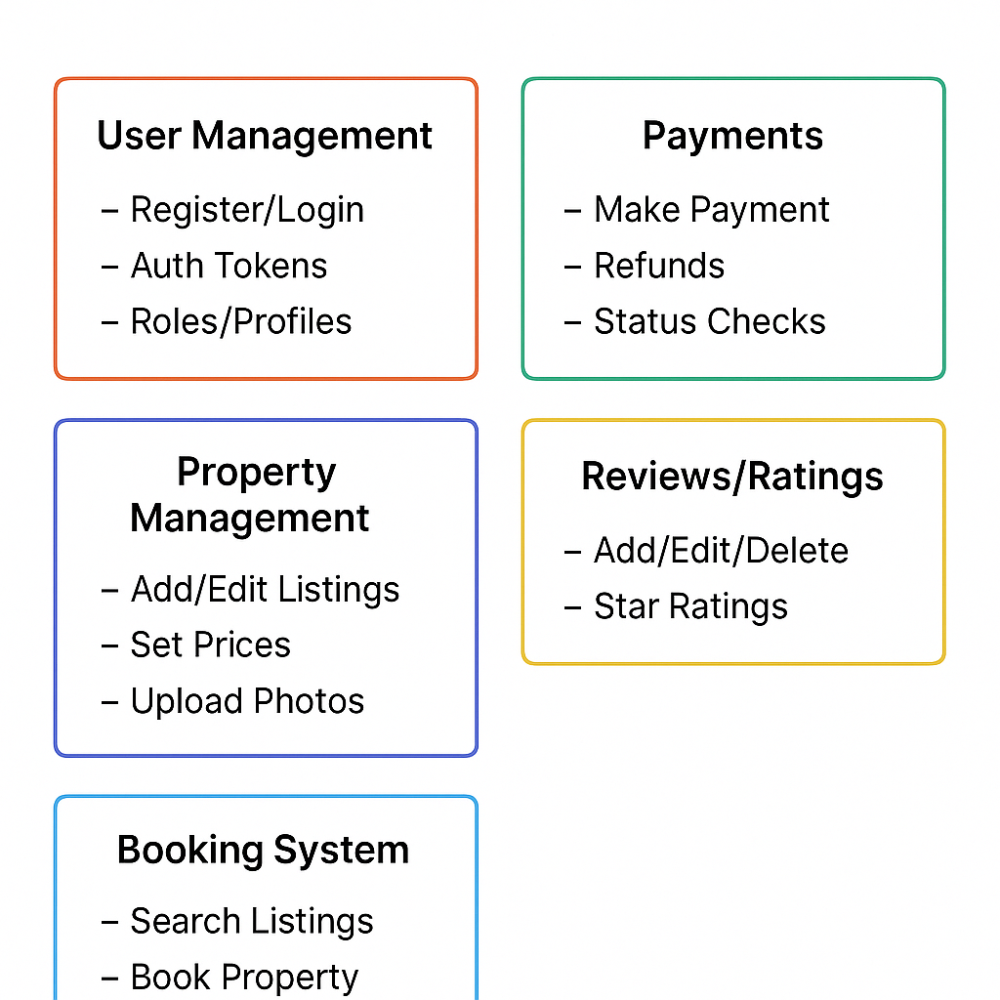

# 🏗️ Airbnb Clone Backend: Features & Functionalities

This document provides a visual and descriptive overview of the **backend features and architecture** for the ALX Airbnb Clone project. It highlights the key modules, their responsibilities, and how they interact to support a fully functional booking platform.

## 📌 Overview

The backend is structured around four major service modules:

1. 🔐 **User Authentication**
2. 🏠 **Property Management**
3. 📆 **Booking System**
4. 💳 **Payments Integration**

These modules interact with each other via API calls and persist data in dedicated databases. The system is designed to mimic the backend architecture of real-world booking platforms like Airbnb.

---

## 🔍 Core Features by Module

### 🔐 User Authentication
Handles secure access control and user identity management.

- User Registration & Login
- Email Verification
- Password Reset
- Role-based Access (Guest, Host, Admin)
- Token-based Authentication (e.g., JWT)

---

### 🏠 Property Management
Allows hosts to manage property listings and metadata.

- Create, Update, Delete Listings
- Upload Photos
- Set Pricing and Availability
- View Property Details
- Filter/Search Listings

---

### 📆 Booking System
Responsible for managing reservations and availability.

- Search Listings by Date, Price, Location
- Book a Property
- View Booking History
- Cancel or Modify Reservations
- Check Availability Calendar

---

### 💳 Payments Module
Integrates with third-party payment services to handle transactions.

- Initiate Payment on Booking
- Payment Confirmation and Receipts
- Refund Processing
- Payment Status Updates
- Integration with external payment gateways (e.g., Stripe)

---

## 🔄 Data Flow & Interaction

Below is a high-level data flow diagram showing how the modules communicate:

> The arrows show direction of data flow and inter-module communication:
>
> - ✅ Authenticated users can access booking and property features.
> - 🧭 The Booking System checks property availability before confirming.
> - 💰 Payment is triggered before finalizing a booking.
> - 🏦 External payment gateways handle transaction processing securely.

---

## 📁 File Structure
features-and-functionalities/
│
├── airbnb-backend-features.png # 📊 PNG diagram showing backend modules & data flow
└── README.md # 📝 This documentation file

yaml
Copy
Edit

---

## 📎 Notes

- This diagram is essential for understanding the logic and interdependence of backend services.
- The project follows modular design principles for better scalability and maintenance.
- All modules can be extended with additional microservices (e.g., Reviews, Notifications) in future phases.

---

## ✅ Next Steps

- Ensure all services have corresponding routes, controllers, and database schemas.
- Implement unit and integration tests for each module.
- Set up CI/CD and deploy to cloud infrastructure for staging.

---

> ✨ _This documentation is part of the ALX Airbnb Backend Documentation Project. For more updates, follow this repo._

