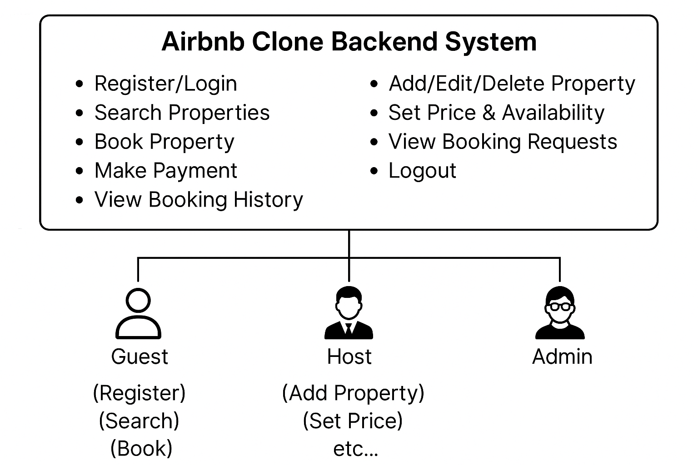

# 🎯 Use Case Diagram – Airbnb Clone Backend

This use case diagram provides a visual representation of how different types of users interact with the core features of the Airbnb Clone backend system.

## 👥 Actors

- **Guest** – Can register, search properties, book, and pay.
- **Host** – Can register, add/edit/delete listings, and manage bookings.
- **Admin** *(Optional)* – Can manage users and monitor platform activity.

## ⚙️ Use Cases

- Register/Login/Logout
- Add/Edit/Delete Property Listings
- Search Properties
- Book Property
- Make Payment
- View Booking History
- Set Pricing and Availability
- View Booking Requests

## 🖼️ Diagram

## 📁 File Structure

use-case-diagram/
├── airbnb-use-case-diagram.png # PNG of the use case diagram
└── README.md # This file

> This diagram is useful for understanding how each user interacts with the backend features and helps in aligning code implementation with user requirements.
